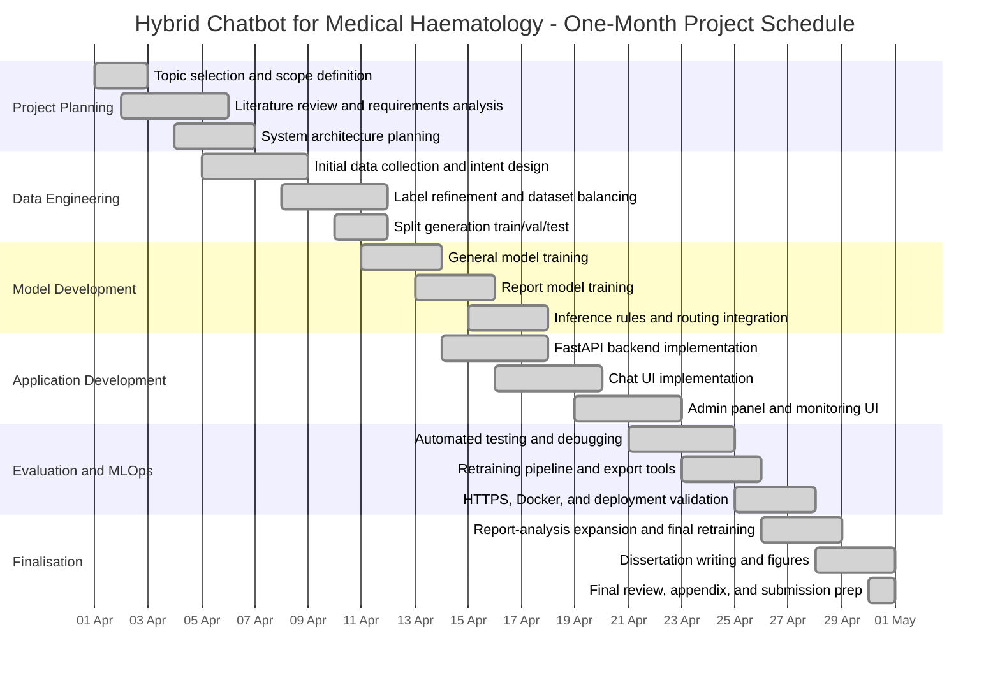

# Hybrid Chatbot Project Gantt Chart

## One-Month Implementation Plan

This Gantt chart presents a structured one-month development schedule for the Hybrid Chatbot for Medical Haematology project. It reflects the practical sequence of work followed in the project lifecycle, from problem definition and dataset preparation through model development, evaluation, deployment, monitoring, and documentation.

## Weekly Summary

### Week 1
- project topic selection
- requirements analysis
- literature review
- architecture planning

### Week 2
- dataset collection
- intent definition
- label balancing
- split generation
- initial model training

### Week 3
- backend and frontend implementation
- routing logic
- retrieval layer
- admin panel
- monitoring functions

### Week 4
- testing and debugging
- retraining pipeline
- deployment and Docker setup
- dissertation writing
- final validation and submission preparation

## Suggested Dissertation Placement

This chart fits well in:
- `Appendix C` as project control documentation
- `Chapter 3` as a short SDLC planning figure if your supervisor wants timeline evidence in the main body

## Figure Caption Suggestion

Use this caption in the dissertation:

**Figure A.1 Project Gantt chart showing the one-month implementation schedule for the hybrid haematology chatbot**
